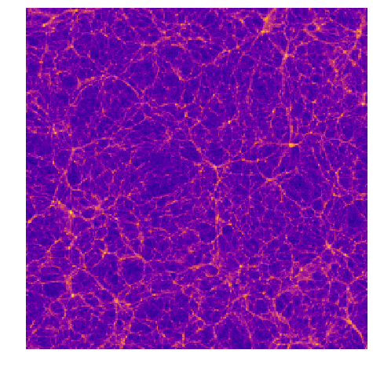
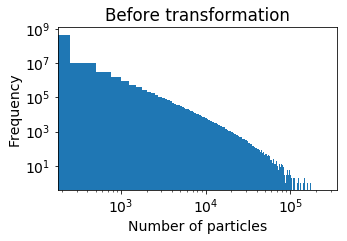
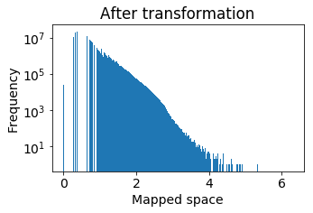
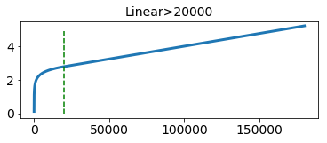
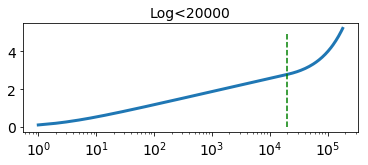

# CosmoGAN

[Nathanaël Perraudin][nath], [Tomasz Kacprzak][tomek], ....

[nath]: https://perraudin.info
[tomek]: http://www.ipa.phys.ethz.ch/people/person-detail.MjEyNzM5.TGlzdC82NjQsNTkxMDczNDQw.html

Using Generative Adversarial Networks to generate replications of N-Body simulation images. This repository contains the code to solve different problems including (2D, 3D, 2D-time, generation part by parts)

## Installation

For a local installation, follow the below instructions.

1. Clone this repository.
   ```sh
   git clone .....
   cd cosmotools
   ```
2. Initialize all the submodules (submodules are git repositories within the git repositories).
	```sh
	git submodule update --init --recursive
	git pull --recurse-submodules
	```


## Required packages

*We hightly recommend to work in a virtual environnement.*

You can simply install those packages with the following command:
	```
	pip install -r requirements.txt
	```
or if you have no gpu:
	```
	pip install -r requirements_nogpu.txt
	```

For some operations, you may require `pynbody` as it was used to preprocess the simulation. If so, you need to install it separately.

## Dataset

The dataset consists of 30 N-body simulations at a scale of 500 MPch and 10 simulations at a scale of 100 Mpch. The dataset is availlable on Zenodo at: 
https://zenodo.org/record/1464832

The dataset does not contain the Nbody simulations as they have a very large size. Instead, we sliced the space into 256 x 256 x 256 cubical areas and counted the number of particules in each area. The result are 3D histograms, where the number of particles is a proxy for matter density.

N-body simulation evolves a cosmological matter distribution over time, starting from soon after the big bang.
It represents matter density distribution as a finite set of massive particles, typically order of trillions.
The positions of these particles are modified due to gravitational forces and expansion of the cosmological volume due to cosmic acceleration.
N-body simulations use periodic boundary condition, where particles leaving the volume on one face enter it back from the opposite side.

To download the dataset, you can simply execute the code:
```sh
python download_nbody.py
```

This script will download the data in the folder `data/nbody/preprocessed_data/` as a list of h5 files. You can then use the function `load_samples_raw` or `load_nbody_dataset` from `cosmotools/data/load.py` to access it easily.

Warning the all evaluation pipeline is tuned for the 500MPch dataset. If you want to use the 100Mpch cubes, the evaluation and the scores need to be adapted.

3D visualization           |  A slice of the cube
:-------------------------:|:-------------------------:
  |  


## Processing the simulations

The first step of the preprocessing is to compute the mass density of particles for each some division of the volume. This step is already done and you can directly access the cubes. The code used to do this is located at `cosmotools/data/generate_cosmo_dataset.py`. We splitted the cube into 256 x 256 x 256 sub-volumes.

**The second step is very important and should be carefully handled.** 
Because of the physical law of gravity, most of the universe is empty, while most of the matter is concentrated in a few small areas and filaments.
As a result, the distribution of pixel values of our 3-D histogram is significantly skewed towards the smaller values and has an elongated tail towards the larger ones. 
 
Histogram of the original cubes          |  Histogram of the mapped cubes
:-------------------------:|:-------------------------:
 | 

The file `cosmotools/data/fmap.py` contains a few functions to perform this mapping. In this work, we used the mapping function `stat_foward` and the inverse mapping function `stat_backward` with parameter `c=2e4` and `shift=1`. 

Foward transformation (linear scale)         |  Foward transformation (log scale)    
:-------------------------:|:-------------------------:
 | 

Reminder: **Before computing the score, the data need to be remapped to its initial domain.**


## Training and evaluation
The training of the model is done using the script found in the folder `nbody-3D`. These script will create checkpoints and tensorboard summaries in the folder `saved_results`. The evaluation is then done using the notebook `generate_sample_3d.ipynb` in the folder `notebooks`. You will need to choose manually good checkpoints in order to get the best results.

Alternatively, you can avoid training the model and download the checkpoints on https://zenodo.org/record/3257564

The easiest way is to use the the script: `download_checkpoints.py`.
```sh
python download_checkpoints.py
```

## Example
You can find an example in the demo notebook

https://github.com/nperraud/CodeGAN/blob/master/WGAN%20demo.ipynb


## Contributors

Perraudin Nathanaël, Rosenthal Jonathan, Srivastava Ankit, Sandro Marcon

Some of the code is based on the work of Andres Rodriguez Escallon.

See the following repository https://github.com/dalab/msc_andres

## License & citation

The content of this repository is released under the terms of the [MIT license](LICENCE.txt).
Please consider citing our papers if you use it.

	```
	....
	```


