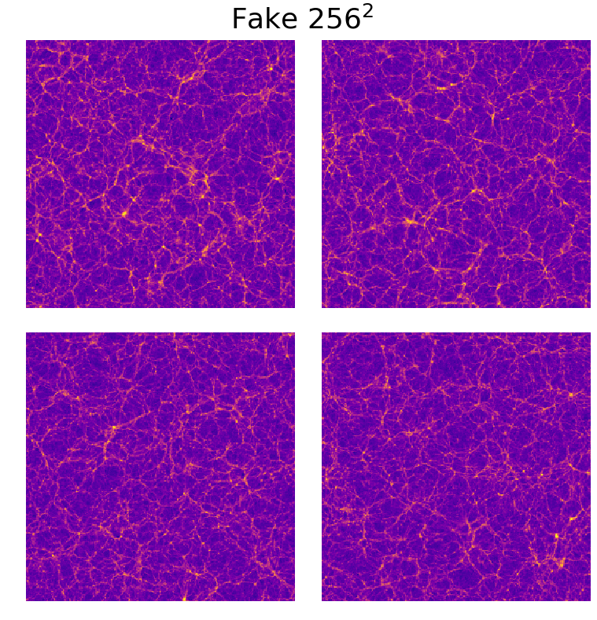

# Dark Matter GAN
Generative adeversarial network for cosmology. This repository contains the code associated to two papers:
* 3Dcosmo: a benchmark dataset for large 3-dimensional generative models [Here](#1.-3Dcosmo:-a-benchmark dataset-for-large-3-dimensional-generative-models-(and 2-dimensional-as-well))
* Emulation of cosmological mass maps with conditional generative adversarial networks [click on this link](#2.-Emulation-of-cosmological-mass-maps-with-conditional-generative-adversarial-networks)

Sections for each of these contributions are availlable after the installation subsection.

## Installation

For a local installation, follow the instructions below.

1. Clone this repository.
   ```sh
   git clone https://renkulab.io/gitlab/nathanael.perraudin/darkmattergan.git
   cd darkmattergan
   ```
2. Initialize all the submodules (submodules are git repositories within the git repositories).
    ```sh
   git submodule update --init --recursive
   ```


### Required packages

*We highly recommend working in a virtual environment.*

You can simply install those packages with the following command:
   ```sh
   pip install -r requirements.txt
   ```
or if you have no gpu:
   ```sh
   pip install -r requirements_nogpu.txt
   ```

For some operations, you may require `pynbody` as it was used to preprocess the simulation. If so, you need to install it separately.

You can also use pipenv:
   ```sh
   pipenv shell
   pipenv install
   ```


# 1. 3Dcosmo: a benchmark dataset for large 3-dimensional generative models (and 2-dimensional as well)

[Nathanaël Perraudin][nath], Ankit Srivastava, [Tomasz Kacprzak][tomek], [Aurelien Lucchi][aurelien], [Thomas Hofmann][thomas], [Alexandre Réfrégier][alex]

[nath]: https://perraudin.info
[tomek]: http://www.ipa.phys.ethz.ch/people/person-detail.MjEyNzM5.TGlzdC82NjQsNTkxMDczNDQw.html
[aurelien]:http://people.inf.ethz.ch/alucchi/
[thomas]:http://www.da.inf.ethz.ch/people/ThomasHofmann/
[alex]:https://cosmology.ethz.ch/

This repository contains the code to take part in the 3DCosmo benchmark. The idea is to use generative models to generate replications of N-Body simulation images. You will find here: baselines for the 2D and 3D case, as well as a pipeline and a score to evaluate your model.

This code is assotiated with the paper *[Cosmological N-body simulations: a challenge for scalable generative models][linkpaper]*  that focuses mostly on scaling GAN to very large samples ( 256x256x256 pixels). 

[linkpaper]: https://arxiv.org/abs/1908.05519


## Dataset

The dataset consists of 30 N-body simulations at a scale of 500 MPch and 10 simulations at a scale of 100 Mpch. The dataset is available on Zenodo at: 
https://zenodo.org/record/1464832

The dataset does not contain the Nbody simulations as they have a very large size. Instead, we sliced the space into 256 x 256 x 256 cubic areas and counted the number of particles in each area. The result consists of 3D histograms, where the number of particles is a proxy for matter density.

N-body simulation evolves a cosmological matter distribution over time, starting from soon after the Big Bang.
It represents matter density distribution as a finite set of massive particles, typically order of trillions.
The positions of these particles are modified due to gravitational forces and expansion of the cosmological volume due to cosmic acceleration.
N-body simulations use periodic boundary condition, where particles leaving the volume on one face enter it back from the opposite side.

To download the dataset, you can simply execute the code:
```sh
python download_nbody.py
```

This script will download the data in the folder `data/nbody/preprocessed_data/` as a list of h5 files. You can then use the function `load_samples_raw` or `load_nbody_dataset` from `cosmotools/data/load.py` to access it easily.

Warning the all evaluation pipeline is tuned for the 500MPch dataset. If you want to use the 100Mpch cubes, the evaluation and the scores need to be adapted.

3D visualization           |  A slice of the cube
:-------------------------:|:-------------------------:
  |  


## Processing the simulations

The first step of the preprocessing is to compute the mass density of particles for each some division of the volume. This step is already done and you can directly access the cubes. The code used to do this is located at `cosmotools/data/generate_cosmo_dataset.py`. We split the cube into 256 x 256 x 256 sub-volumes.

**The second step is very important and should be carefully handled.** 
Because of the physical law of gravity, most of the universe is empty, while most of the matter is concentrated in a few small areas and filaments.
As a result, the distribution of pixel values of our 3-D histogram is significantly skewed towards the smaller values and has an elongated tail towards the larger ones. 
 
Histogram of the original cubes          |  Histogram of the mapped cubes
:-------------------------:|:-------------------------:
 | 

The file `cosmotools/data/fmap.py` contains a few functions to perform this mapping. In this work, we used the mapping function `stat_foward` and the inverse mapping function `stat_backward` with parameter `c=2e4` and `shift=1`. 

Forward transformation (linear scale)         |  Forward transformation (log scale)    
:-------------------------:|:-------------------------:
 | 

Reminder: **Before computing the score, the data need to be remapped to its initial domain.**


## Training and evaluation (3D)
The training of the model is done using the script found in the folder `nbody-3D`. You can use `nbody-0-32.py`, `nbody-32-64.py`, `nbody-64-256.py` to train the three scales used in the paper.
These scripts will create checkpoints and tensorboard summaries in the folder `saved_results`. The evaluation is then done using the notebook `generate_sample_3d.ipynb` in the folder `notebooks`. You will need to choose manually good checkpoints in order to get the best results.

Alternatively, you can avoid training the model and download the checkpoints on https://zenodo.org/record/3257564

The easiest way is to use the script: `download_checkpoints.py`.
```sh
python download_checkpoints.py
```

**Obtained scores for 3D**

|                | Score |
|----------------|-------|
| PSD            | 1.58  |
| Mass histogram | 0.63  |
| Peak histogram | 8.17  |

Check the samples in video [here](https://www.youtube.com/watch?v=nWXP6DVEalA).

## Training and evaluation (2D)
While the paper focuses on the 3d case, we also made some benchmark in 2D. To train our base architecture, you can use the scripts in the folder `nbody-2d`. To launch the training for a GAN generating images of size 128, you can use
```sh
python experiment.py 128
```
The script works for the size 32,64,128,256 but can trivially be adapted to any size.

The evaluation is done with the notebook: `results_2d.ipynb` from the folder `notebooks`.

**Obtained scores for 2D**

| Size                 | 32x32 | 64x64 | 128x128 | 256x256 |
|----------------------|:-----:|:-----:|:-------:|:-------:|
| PSD score            | 9.24  | 5.08  | 5.27    | 3.36    |
| Mass histogram score | 7.44  | 5.56  | 4.37    | 5.66    |
| Peak histogram score | 3.25  | 1.09  | 0.89    | 1.22    |
 
Can you differentiate | between real and fake?|
:-------------------------:|:-------------------------:
 | 

## Example
The best way to get started is to start with this [this demo notebook](https://github.com/nperraud/CodeGAN/blob/master/WGAN%20demo.ipynb)


# 2. Emulation of cosmological mass maps with conditional generative adversarial networks

[Nathanaël Perraudin][nath], Sandro Marcon, [Aurelien Lucchi][aurelien], [Tomasz Kacprzak][tomek]

[nath]: https://perraudin.info
[tomek]: http://www.ipa.phys.ethz.ch/people/person-detail.MjEyNzM5.TGlzdC82NjQsNTkxMDczNDQw.html
[aurelien]:http://people.inf.ethz.ch/alucchi/


This code is assotiated with the paper *[Emulation of cosmological mass maps with conditional generative adversarial networks][linkpaper2]*  that focuses mostly on conditioning GAN to generate cosmological mass maps with different paramters.

[linkpaper2]: https://arxiv.org/abs/2004.08139


## Abstract
Weak gravitational lensing mass maps play a crucial role in understanding the evolution of structures in the universe and our ability to constrain cosmological models. The prediction of these mass maps is based on expensive N-body simulations, which can create a computational bottleneck for cosmological analyses. Simulation-based emulators of map summary statistics, such as the matter power spectral and its covariance, are starting to play increasingly important role, as the analytical predictions are expected to reach their precision limits for upcoming experiments. Creating an emulator of the cosmological mass maps themselves, rather than their summary statistics, is a more challenging task. Modern deep generative models, such as Generative Adversarial Networks (GAN), have demonstrated their potential to achieve this goal. Most existing GAN approaches produce simulations for a fixed value of the cosmological parameters, which limits their practical applicability. We propose a novel conditional GAN model that is able to generate mass maps for arbitrary sets of cosmological parameters $\Omega_m$ and $\sigma_8$, for a given source galaxy redshift distribution $n(z)$. Our results show that our conditional GAN can interpolate efficiently within the space of simulated cosmologies, and generate maps anywhere inside this space with good visual quality high statistical accuracy. We perform an quantitative comparison of the N-body and GAN -generated maps using a range of metrics: the pixel histograms, peak counts, power spectra, bispectra, Minkowski functionals, correlation matrices of the power spectra, the Multi-Scale Structural Similarity Index (MS-SSIM) and our equivalent of the Fréchet Inception Distance (FID). We find a very good agreement on these metrics, with typical differences are $<$5\% at the centre of the simulation grid, and slightly worse for cosmologies at the grid edges. The agreement for the bispectrum is slightly worse, on the $<$20\% level. This contribution is a step towards building emulators of mass maps directly, capturing both the cosmological signal and its variability.


## Dataset

The dataset consists of 57 sets of 12'000 sky convergence maps for a total of $684'000$ samples. It is available on Zenodo at: 
https://zenodo.org/record/4564408

This dataset was first proposed in the paper *Cosmological constraints with deep learning from KiDS-450 weak lensing maps* from Fluri et al. Please be kind and cite their work if you use it:
```
    @article{fluri2019cosmological,
      title={Cosmological constraints with deep learning from KiDS-450 weak lensing maps},
      author={Fluri, Janis and Kacprzak, Tomasz and Lucchi, Aurelien and Refregier, Alexandre and Amara, Adam and Hofmann, Thomas and Schneider, Aurel},
      journal={Physical Review D},
      volume={100},
      number={6},
      pages={063514},
      year={2019},
      publisher={APS}
    }
```
If you use this code, please also cite our papers (see the citation section bellow).

To download the dataset, you can simply execute the code:
```sh
python download_kids.py 
```

This script will download the data in the folder `data/KiDs450_maps` as a list of `npy` files. 

You can then use the function `load_samples_raw` or `load_nbody_dataset` from `cosmotools/data/load.py` to access it easily.


3D visualization           |  A slice of the cube
:-------------------------:|:-------------------------:
  |  


# License & citation

The content of this repository is released under the terms of the [MIT license](LICENCE.txt).
Please consider citing our papers if you use it.
    ```
    @inproceedings{perraudin2019cosmological,
      title = {Cosmological N-body simulations: a challenge for scalable generative models},
      author = {Nathana\"el, Perraudin and Ankit, Srivastava and Kacprzak, Tomasz and Lucchi, Aurelien and Hofmann, Thomas and R{\'e}fr{\'e}gier, Alexandre},
      year = {2019},
      archivePrefix = {arXiv},
      eprint = {1908.05519},
      url = {https://arxiv.org/abs/1908.05519},
    }
    ```
and 
    ```
    @article{perraudin2020emulation,
      title={Emulation of cosmological mass maps with conditional generative adversarial networks},
      author={Perraudin, Nathana{\"e}l and Marcon, Sandro and Lucchi, Aurelien and Kacprzak, Tomasz},
      journal={arXiv preprint arXiv:2004.08139},
      year={2020}
    }
    ```


## Contributors

The main contributor is Perraudin Nathanaël. He was helped by Rosenthal Jonathan, Srivastava Ankit and Sandro Marcon. Some of the code is based on the work of Andres Rodriguez Escallon ([this repository][repository]).

[repository]:https://github.com/dalab/msc_andres